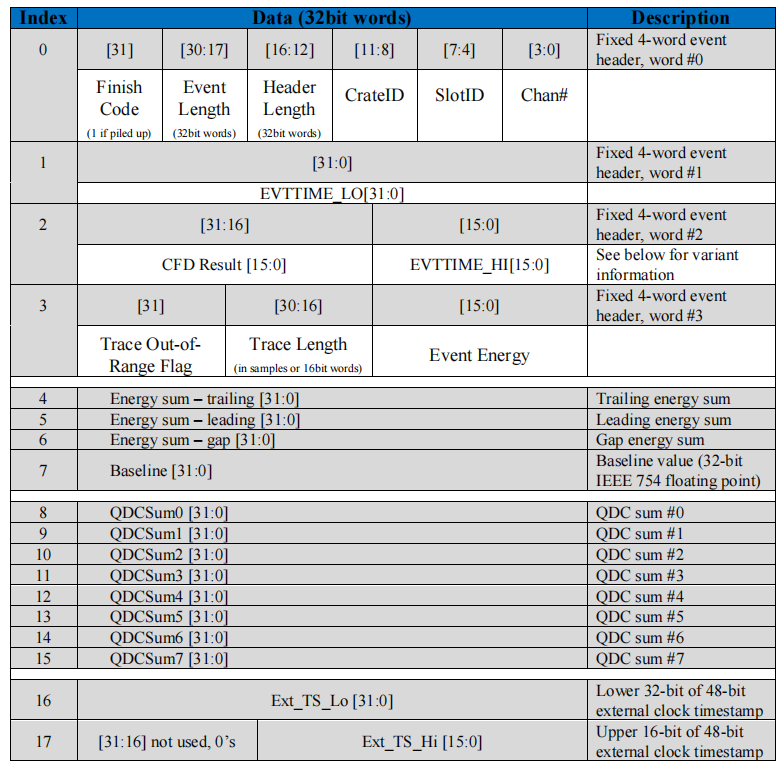

# 解码映射

这一步包含对 XIA 的解码+映射，和对 VME 的映射。

## 解码



XIA 的二进制数据具体结构可以看 XIA 的说明手册，上图就是来自说明手册的。我们在上一节已经解释了获取系统中的**事件**和一般所说的**物理事件**的区别。在解码阶段，我们需要做的就是把 XIA 中单个通道的**事件**解码出来。而在 VME 中已经有成熟的 convert 程序，改改就能用。

XIA 中的事件是紧凑排列的，每个事件是独立的，都以固定的 16 字节开头，作为事件头。事件头中包含了机箱、插件、通道用于定位硬件位置，也包含了触发信号的能量、时间等物理信息，以及头部长度、事件长度等结构信息。根据这些信息，配合说明手册，即可解码。

## 映射

映射一般称为 mapping，就是将获取系统中的插件通道转换为探测器的编号或者探测器的通道。在 XIA 中，一般以 (crate_id, slot_id, channel) 三元数组定位 pixie16 插件单个通道，映射就是将对应通道转化为 (detector_id, detector_channel) 的形式，并且分割存储到各自探测器的 ROOT 文件中。举个例子，对于 DSSD 来说，探测器的通道定位一般为 (id, side, strip)，其中 id 表示不同的 DSSD，比如说 T0D1、T0D2，side 是 front 或者 back，strip 则是 0 到 31 或者 0 到 63。同理，VME 的映射也差不多，只不过 VME 中能量、时间是记录在不同的插件中，所以是从 adc、madc、tdc、gdc 中取数据，再合并到同一个探测器通道中，而且 VME 的 adc 或者 madc 中都有 pedestal，即空信号不为零，需要根据数据确定阈值卡掉低能的空信号。

## 实现

### raw reader

项目中使用 `RawReader` 来读取单个 pixie16 插件的原始数据，构造函数为

```cpp
RawReader(
    const char* raw_path,
    const char *prefix,
    const int run,
    const int crate,
    const int module,
    const int rate
);
```

+ `raw_path` 是原始数据路径；
+ `prefix` 数据前缀，本次实验都是 data；
+ `run` 是 run 编号；
+ `crate` 是机箱编号，本次实验中是 0、1、2；
+ `module` 是插件编号，从 0 开始，不需要考虑实际机箱中的空槽位，从左到右升序排列；
+ `rate` 是插件的采样率，100、250、500，根据实际采样率填写。

`RawReader` 通过 `Read` 读入一个 XIA 事件并解码

```cpp
int Read(
    DecodeEvent *event,
    RawEnergySum **sum = nullptr,
    RawQDC **qdc = nullptr,
    RawExternalTime **ext = nullptr,
    DecodeTraces *trace = nullptr
);
```

+ `event` 是解码后的事件头，包含模块、通道、能量、时间信息；
+ `sum` 是解码后的能量加和，本次实验没有用到，保持空指针；
+ `qdc` 是解码后的波形积分，本次实验没有用到，保持空指针；
+ `ext` 是解码后的外部时间戳；
+ `trace` 是解码后的波形；
+ 函数返回该事件的长度（字节），如果长度小于 16，说明已经读完了整个文件。

`RawReader` 本身还是比较底层，其实现严格按照说明手册的内容来写。唯一需要注意的是本次实验中有一些损坏的插件，可能会一些带有瑕疵的二进制数据，目前发现主要有两种形式：

+ 事件头部的第 2 字节、第 10 字节的最高位被置为 1。
  + 第 2 字节的最高位是描述事件头部长度的一部分，目前主要观察到的是本来是长度是 4 的置位后变成 12，和事件长度、波形长度不自洽（正常来说，事件长度=波形长度/2+头部长度），所以会观察到波形长度位 0，头部长度为 12，事件长度为 4 的事件。目前的处理方法是发现波形长度为 0，头部长度为 12，事件长度为 4 的事件，直接将头部长度修正为 4。
  + 第 10 字节是描述时间戳高位的，最高位为 1 需要十几天才能达到，出现在本次实验中必然是错误的。目前的解决方法是发现时间戳最高位为 1 就置为 0。
  + 幸运的是上述两个错误都是可以被很好地发现的，有没有更多的类似瑕疵目前仍未知道。
+ 一个事件后紧跟着一个字节的 0，目前解决方法是跳过一个字节。

考虑到还有可能有别的非固定样式的错误，`RawReader` 会检查每个事件的头部长度、事件长度、波形长度是否自洽，如果不是自洽的，会尝试跳过一个字节，读取新的事件头部，直到找到连续多个自洽的头部为止。

### crusher

`Crusher` 包含了多个 `RawReader`，用来处理像是 DSSD 这样的横跨多个 pixie16 插件的探测器。其构造函数为

```cpp
Crusher::Crusher(
	const int num,
	const int run,
	const int crate,
	const std::vector<int> &module,
	const std::vector<int> &rate,
	const char *raw_path,
	const char *prefix
)
```

+ `num` 是读取插件个数；
+ `run` 是 run 序号；
+ `crate` 是机箱序号，本次实验中是 0、1、2；
+ `module` 是插件序号的数组，比如说 T0D1 对应 `[4, 5, 6, 7]`；
+ `rate` 是插件采样率的数组，必须是 100、250 或者 500；
+ `raw_path` 是原始数据的存储路径；
+ `prefix` 是原始数据的文件名前缀，本次实验都是 data。

`Crusher` 通过 `GetEvent` 函数得到解码后的事件，该函数同时读取多个插件的数据，返回时间戳最小的。

### 小结

`RawReader` 负责读取单个模块的数据并解码，`Crusher` 则是从多个模块中挑选时间戳最小的 XIA 事件返回，两者共同完成 XIA 的解码和映射。至于 VME 的比较简单，这里不展开了叙述了。