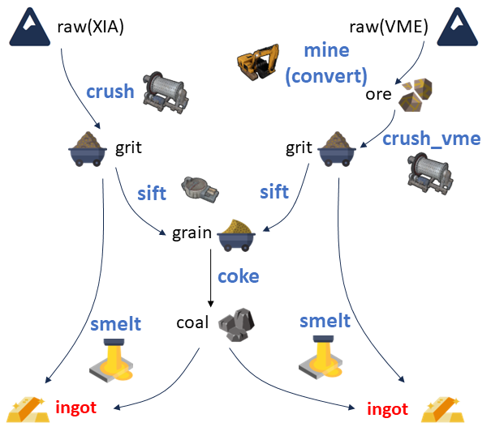

# 整体流程

本项目将预处理过程类比为简单的矿石处理流程，如下图所示

实际的输入是 XIA 的原始数据（raw）以及 VME 经过 convert 的数据（ore）。在上述流程中，将数据分成了大致三个层级：

1. raw 和 ore。其中 raw 是原始数据，一般是二进制形式存储，XIA 里面的 .bin 文件，以及 VME 里面的 .ridf 文件。ore 指的是从二进制形式转换成 ROOT 文件的数据，对于 VME 就是经过 convert 后得到的 ROOT 文件；XIA 中没有存储 ore 层级的数据，只在内存中短暂存在过。
2. grit 和 grain。grit 意为经过粉碎后，得到的各个探测器独立的事件。grain 则是经过两套探测器对齐后，得到的对齐事件。
3. coal 和 ingot。ingot 就是最终输出的 ROOT 文件，格式统一、结构稳定，是后续分析的基石，故命名为锭，是一种标准化产物。而 coal 则是标准化的触发，因为重组探测器事件需要用到重组后的触发。

而处理的过程（程序）也做了类比：

+ mine，从二进制到 ROOT 形式，叫它 decode、convert 都是可以的；
+ crush，即 mapping，从插件的通道转换到探测器的序号、或者探测器的细分通道；
+ sift，即 align，将两套获取系统的事件对齐；
+ coke，重组触发事件，为后续 smelt 各个探测器的事件准备；
+ smelt，重组事件，对于 XIA 和 VME 有不同的处理，但是简单来说就是根据对齐后的触发，将 mapping 后的事件关联到触发上，每一个触发都带着一堆事件，这些事件合并起来就是一个物理事件。

## 事件

在进入细节之前，必须搞清楚**事件**的概念，一个是**物理事件**，另一个是获取系统的**事件**。一个物理事件即一个反应道的所有粒子对探测器的所有触发，举个例子：

+ 束流粒子经过了靶前的塑闪和 PPAC，触发了塑闪和PPAC；
+ 束流和靶核反应后，比如说弹性碰撞，打出了两个粒子：
  + 靶核反冲到了 T1，触发了 T1 中的 DSSD 和 SSD；
  + 反应后的束流则触发了 T0 的多块 DSSD，比如说 T0D1、T0D2、T0D3；

因此，这个**物理事件**包含了塑闪、PPAC、T1D、T1S、T0D1、T0D2、T0D3 的所有有效信号。

而从获取的角度来看，XIA 会将一个通道的一次触发作为**事件**，**事件**中包含这次触发的能量、时间，甚至波形、外部时间戳、波形积分等等，所以一个**物理事件**应该包含多个 XIA 的通道**事件**。而 VME 则是一个事件中包含所有的 ADC、TDC 等等的所有通道的事件，所以在只有 VME 获取时，一个**物理事件**就是一个 VME 的**事件**；而在当前配置下，一个 VME **事件**是一个**物理事件**的一部分。

总的来说，要想得到一个本次实验中的**物理事件**，需要打包多个 XIA 的**事件**，以及至多一个 VME 的**事件**（VME 可能没有触发，就是零个**事件**）。