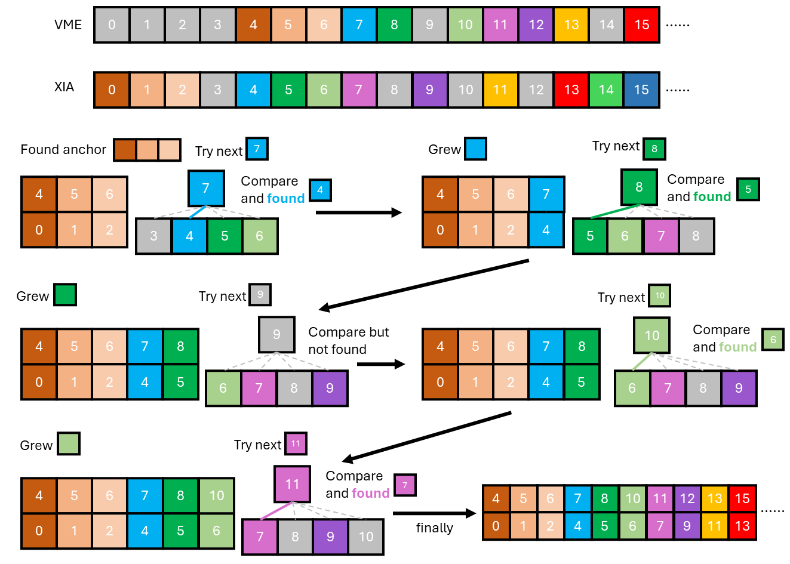

# 对齐筛选

由于两套获取系统的启动事件不一致，而且触发是相对独立的，也没有 busy 保护，所以两套获取系统之间，即使是 VME 触发也不能一一对应，但是绝大部分（大于 99%）的事件都是有对应的。另一方面，对应的事件之间的时间差总是在极小的窗口内。比如说事件 A 和事件 B 在两边都有记录，那么 XIA 中 A、B 的时间差，于 VME 中 A、B 的时间差应该是相近的，本次实验中认为在时间差 10000 ns 以内都算是对齐。

上图给出了对齐的大致流程，为了方便叙述，这里定义 VME 中事件 $i$ 和事件 $j$ 的时间差为 $t_{i, j}^v$，XIA 中的事件 $i$ 和 事件 $j$ 的时间差为 $t_{i,j}^x$。

+ 找到两套获取系统中的锚点，即连续三个事件一一对应，或者说三个事件之间的时间差一一对应。以上图为例，即满足 $t^v_{4,5} = t^x_{0,1}$ 且 $t^v_{5,6} = t^x_{1,2}$;
+ 找到锚点后，尝试 VME 下一个事件，寻找 XIA 中时间差接近的。以上图为例：
  + 尝试 VME 事件 7，计算 $t^v_{6,7}$；
  + XIA 中计算 $t^x_{2,3}$ 到 $t^x_{2,6}$；
  + 对比发现 $t^v_{6,7} \approx t^x_{2,4}$，认为 VME 事件 7 和 XIA 事件 4 是同一个事件；
  + 图示仅对比了 XIA 中 4 个事件，实际对比 **10** 个事件；
+ 如果下一个 VME 事件在若干个（实际是 10 个）XIA 事件中没有对应的，舍弃这个 VME 事件，尝试下一个事件。以上图为例，VME 事件 9 没有对应的事件，舍弃后尝试事件 10，发现有对应的，记录并尝试下一个 VME 事件；
+ 如果连续多个 VME 事件都找不到对应的 XIA 事件（系统遇到某种跳变），回到第一步，重新寻找锚点。

经过以上步骤，得到了一个 VME 和 XIA 事件的对照表，此表保存在 `grain` 目录下，以供后续重组事件使用。